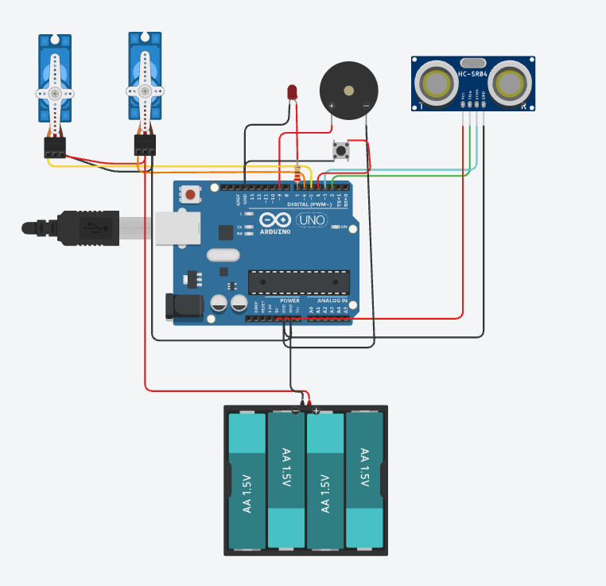

# Mini-Nathan

Este es el primer proyecto de hardware que he hecho.
Robot que sirve tanto como mascota de mesa como reproductor de música básico. Busca a alguien mirando a los lados y se duerme si no encuentra a nadie por mucho tiempo.
Consiste en dos servos que hacen mover una cabeza tanto vertical como horizontalmente, un buzzer que reproduce música, un sensor táctil y un led.

## Materiales: 

- 1x Arduino Uno R3
- 2x Servo SG90
- 1x Buzzer pasivo
- 1x LED 5mm
- 1x Sensor de distancia ultrasónico (HC-SR04)
- 1x Sensor táctil capacitivo (TTP223B)
- 1x Portapilas para 2 baterías 18650
- 2x Baterías recargables de iones de litio 18650 (3.7V)
- 1x Resistencia de 220 Ω

## Cómo Compilar (Firmware Compilation & Flashing Instructions)

1. Descarga e instala el [Arduino IDE](https://www.arduino.cc/).
2. Abre el archivo 'Code/Mini-Nathan/Mini-Nathan.ino' en el Arduino IDE.
3. Selecciona la placa: 'Herramientas > Placa > Arduino AVR Boards > Arduino Uno'.
4. Conecta el Arduino Uno por USB, elige el puerto COM correcto en 'Herramientas > Puerto' y haz clic en Subir (Upload).
   
## Impresión 3D

Este proyecto está hecho enteramente con el propósito de ser materializado por medio de impresoras 3D. Los archivos listos para imprimirse se pueden encontrar en la carpeta 'STL_Files' en el directorio 'Hardware/Design/STL_Files'.

## Diagrama esquemático del circuito y organización de la placa

### Diagrama esquemático
La esquemática completa diseñada en EasyEDA:

### Organización del hardware y cableado
*Nota: Este montaje utiliza cableado sobre una protoboard en lugar de una PCB personalizada.*

A continuación se muestra el cableado utilizado:

*En el circuito mostrado arriba, se utiliza un botón pulsador para representar el sensor táctil capacitivo TTP223, y las baterías mostradas en el diagrama reemplazan a las baterías recargables 18650.*

## Lista de materiales (BOM)

La lista completa de componentes, cantidades y enlaces de referencia necesarios para construir este proyecto se puede encontrar en el archivo **[BOM](./BOM.csv)** ubicado en la raíz de este repositorio.
